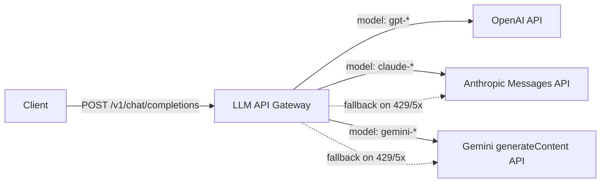

# LLM API Gateway

A lightweight reverse proxy in Go that unifies access to OpenAI, Anthropic,
and Google Gemini behind a single OpenAI-compatible `/v1/chat/completions`
endpoint, with automatic fallback, per-key rate limiting, and structured
logging.



## Features

- **Unified endpoint** — `POST /v1/chat/completions` accepts and returns the
  OpenAI chat completions schema regardless of which provider serves the
  request.
- **Provider interface** — `Name`, `Send`, `Models`, `HealthCheck`. Each
  backend (OpenAI, Anthropic, Gemini) implements it independently; the proxy
  has no knowledge of provider internals.
- **Format translation** — Anthropic and Gemini requests/responses are
  translated to and from the OpenAI schema (system message handling, role
  remapping, token usage).
- **Automatic fallback** — on a retryable error (429 or 5xx) from the
  primary provider, the gateway retries the request against the next
  provider in `fallback_chain`.
- **Per-key rate limiting** — token bucket implemented with `sync.Mutex`,
  keyed by the client's `Authorization` header, returning `429` with
  `Retry-After`.
- **Structured logging** — `log/slog`, JSON or text, with per-request
  `X-Request-ID` correlation.
- **Health checks** — `GET /health` (liveness) and `GET /health/providers`
  (per-provider connectivity).
- **Graceful shutdown** — `SIGINT`/`SIGTERM` drain in-flight requests before
  exit.

## Quick start

```bash
cp .env.example .env
# edit .env with your provider API keys

docker-compose up --build
```

```bash
curl -s http://localhost:8080/v1/chat/completions \
  -H "Content-Type: application/json" \
  -H "Authorization: Bearer local-dev" \
  -d '{
    "model": "claude-sonnet-4-6",
    "messages": [
      {"role": "system", "content": "You are concise."},
      {"role": "user", "content": "What is a token bucket?"}
    ]
  }'
```

Example response:

```json
{
  "id": "msg_01...",
  "object": "chat.completion",
  "model": "claude-sonnet-4-6",
  "choices": [
    {
      "index": 0,
      "message": {"role": "assistant", "content": "A token bucket is..."},
      "finish_reason": "stop"
    }
  ],
  "usage": {"prompt_tokens": 18, "completion_tokens": 42, "total_tokens": 60}
}
```

## Running locally without Docker

```bash
go run ./cmd/gateway -config config.yaml
```

## Configuration reference (`config.yaml`)

| Key | Description |
|---|---|
| `server.port` | HTTP listen port |
| `server.read_timeout` / `write_timeout` | stdlib `http.Server` timeouts |
| `providers.<name>.api_key` | `${ENV_VAR}` reference, expanded at load time |
| `providers.<name>.base_url` | Provider API base URL |
| `providers.<name>.timeout` | Per-request HTTP client timeout |
| `providers.<name>.models` | Model names this provider serves; drives routing |
| `fallback_chain` | Ordered provider names tried after a retryable error |
| `rate_limit.enabled` | Toggle the rate limiter middleware |
| `rate_limit.requests_per_minute` / `burst` | Token bucket parameters |
| `logging.level` / `format` | `debug`/`info`/`warn`/`error`, `json`/`text` |

A provider is only registered if its API key is non-empty, so the gateway
runs fine with only a subset of providers configured.

## Endpoints

| Method | Path | Description |
|---|---|---|
| `POST` | `/v1/chat/completions` | OpenAI-compatible chat completions |
| `GET` | `/health` | Gateway liveness |
| `GET` | `/health/providers` | Per-provider connectivity check |

## Tests

```bash
go test ./... -v -cover
```

Tests cover model-to-provider routing, request validation, fallback
behavior (retryable vs. non-retryable errors), OpenAI ↔ Anthropic and
OpenAI ↔ Gemini format translation, and the rate limiter's concurrency
behavior — all using `testing` + `net/http/httptest`, no third-party
assertion libraries.

## Design decisions

**`net/http` instead of a framework.** Routing needs (method + path
matching) are fully covered by Go 1.22's `http.ServeMux` pattern matching
(`"POST /v1/chat/completions"`). A framework would add a dependency without
adding capability.

**Token bucket implemented from scratch.** `sync.Mutex`-guarded buckets with
continuous refill (`tokens += elapsed * rate`) avoid pulling in a rate
limiting library for what is a well-understood, ~80-line algorithm — and it
keeps the concurrency model explicit.

**OpenAI schema as the unified format.** Clients already speak this format
broadly, and OpenAI's `messages`/`choices`/`usage` shape maps cleanly onto
both Anthropic's Messages API (modulo the `system` field) and Gemini's
`contents`/`candidates` shape, so it serves as a natural pivot format in
both directions.

**Fallback preserves the original request.** When a provider fails with a
retryable error (429/5xx/transport error), the gateway retries the *same*
`ChatRequest` against the next provider in `fallback_chain`, skipping the
one that just failed. This assumes the configured fallback providers can
serve the requested model — operators should order `fallback_chain` and
`providers.<name>.models` accordingly.

**Single external dependency.** Only `gopkg.in/yaml.v3` is required; HTTP
server, HTTP client, JSON, logging, and testing are all standard library.
