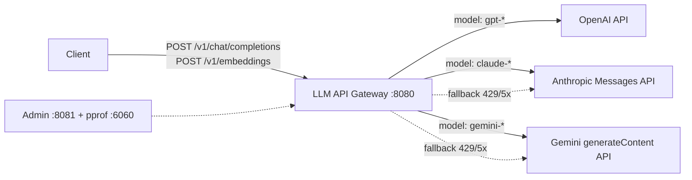
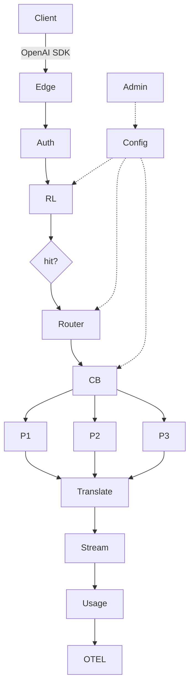

# LLM API Gateway — v1.0.0

[](https://github.com/Francisco-cor/LLM-API-Gateway/actions/workflows/ci.yaml)
[](go.mod)
[](coverage.out)
[](LICENSE)
[](Dockerfile)
[](deploy/k8s/)

A lightweight reverse proxy in Go that unifies OpenAI, Anthropic & Gemini behind a single **OpenAI-compatible** API — with fallback, streaming, resilience, observability, rate-limit, cache, routing, embeddings & control plane hot-reload + performance hardening. Fases 1-11 complete, `v1.0.0` production-ready.


```mermaid
flowchart LR
    Client -->|POST /v1/chat/completions<br>POST /v1/embeddings| Gateway[LLM API Gateway :8080]
    Gateway -->|model: gpt-*| OpenAI[OpenAI API]
    Gateway -->|model: claude-*| Anthropic[Anthropic Messages API]
    Gateway -->|model: gemini-*| Gemini[Gemini generateContent API]
    Gateway -.fallback 429/5xx.-> Anthropic
    Gateway -.fallback 429/5xx.-> Gemini
    Admin[Admin :8081 + pprof :6060] -.-> Gateway
```

**Time-to-first-success <2 min** (see Quick start). If you can `docker` + `curl`, you can run it.

## Features

- **Unified endpoint** — `POST /v1/chat/completions` + `POST /v1/embeddings` OpenAI-compatible. Auto-translation via `internal/translate` (Fase 8).
- **Provider interface** — `Name/Send/SendStream/Embed/Models/HealthCheck/DiscoverModels` — add a provider = 1 file + translate (see `CONTRIBUTING.md`).
- **Intelligent routing** — `providers.<name>.models` wildcards `gpt-4*`, regex `gpt-4.*`; `routing.weighted` canary 90/10 ±5% in 1k reqs; auto-discovery `models: []` → `GET /v1/models`.
- **Streaming SSE** — `stream:true` `text/event-stream` + Anthropic/Gemini → OpenAI `data: {...}` + `data: [DONE]` + `GET /v1/models`, `tools`/`tool_choice`/`response_format`.
- **Resilience** — retry jitter 3×200ms, circuit breaker 5→open 30s half-open 1, hedge 300ms race, `Retry-After` propagation, `X-Gateway-Provider`.
- **Observability** — Prometheus `/metrics` (`gateway_requests_total`, `tokens_total`, `cache_hits`, `ProviderErrors`, `CircuitState`), OTEL `traceparent` span per provider, `slog` with `request_id/tenant/provider/latency_ms`, Jaeger/Prometheus/Grafana via `docker-compose`.
- **Traffic control** — sharded 16× `fnv` + TTL 10m limiter (56ns `Allow`), token-aware `AllowN`, per-tenant/model overrides, monthly budget `insufficient_quota`, Redis Lua `INCR+EXPIRE` with memory fallback.
- **Cache** — `X-Cache:HIT/MISS` LRU 1000 TTL 5m + Redis + semantic 0.97, `X-Cache-TTL/Skip`, only 200 non-stream, `sha256` key 1.8µs, hit 75ns.
- **Security** — Bearer multi-tenant + scopes/expiry, CORS allowlist, `X-Content-Type-Options nosniff` etc, secrets redacted `***`.
- **Health** — `GET /health` (uptime), `/health/providers` fan-out 3s parallel `degraded` handling, `/livez`/`/readyz` (K8s, `SetReady(false)` draining).
- **Control plane** — Admin `:8081` `GET /admin/config` redacted, `POST /admin/reload` 400 rollback, `GET /admin/providers`, `PATCH /admin/config` hot knobs (`rate_limit/cache/circuit/hedge/routing/logging`), file watcher 1s poll + `SIGHUP`.
- **Perf & Ops** — `ReadHeaderTimeout 5s` anti-Slowloris, `IdleTimeout 120s` keep-alive, shared `Transport MaxIdleConns100/PerHost20/KeepAlive30s`, `sync.Pool` JSON buffers, K8s `Deployment/HPA 3→10/PDB min 2/ServiceMonitor`, `pprof :6060` behind admin auth, `BENCH.md` + `k6` 1k RPS p95<30ms, `readOnlyRootFilesystem` + `runAsNonRoot`.
- **DX & Release** — `examples/` (curl/python/node/langchain/postman), `CONTRIBUTING.md` (<10 min), `docs/ARCHITECTURE.md` C4 + ADR-001..003, `CHANGELOG.md` + `VERSION` SemVer `v1.0.0`, `make dev` air live-reload.

## Quick start (<2 min)

```bash
cp .env.example .env
# edit .env — set at least one of OPENAI_API_KEY / ANTHROPIC_API_KEY / GEMINI_API_KEY
# optionally: GATEWAY_API_KEY for auth, REDIS_URL, OTEL_EXPORTER_OTLP_ENDPOINT

docker-compose up --build -d
# waits ~30s healthcheck
curl -s http://localhost:8080/health | jq
# {"status":"ok","uptime_seconds":...,"ready":true}

curl -s http://localhost:8080/v1/models -H "Authorization: Bearer local-dev" | jq
# {"object":"list","data":[{"id":"gpt-4o","object":"model","owned_by":"openai"},...]}

curl -s http://localhost:8080/v1/chat/completions \
  -H "Content-Type: application/json" \
  -H "Authorization: Bearer local-dev" \
  -d '{"model":"claude-sonnet-4-6","messages":[{"role":"user","content":"What is a token bucket?"}]}' | jq
# {"id":"msg_01...","object":"chat.completion","model":"claude-sonnet-4-6","choices":[{"message":{"role":"assistant","content":"..."},"finish_reason":"stop"}],"usage":{"prompt_tokens":...}}

# streaming
curl -N http://localhost:8080/v1/chat/completions \
  -H "Content-Type: application/json" \
  -H "Authorization: Bearer local-dev" \
  -d '{"model":"gpt-4o","messages":[{"role":"user","content":"hi"}],"stream":true}'
# data: {"id":"chatcmpl-...","choices":[{"delta":{"role":"assistant","content":"Hi"}}]}
# data: [DONE]

# embeddings
curl -s http://localhost:8080/v1/embeddings \
  -H "Content-Type: application/json" \
  -H "Authorization: Bearer local-dev" \
  -d '{"model":"text-embedding-3-small","input":"hello world"}' | jq

# metrics / admin
curl -s http://localhost:8080/metrics | grep gateway_requests_total
curl -s http://localhost:8081/admin/config -H "Authorization: Bearer $ADMIN_API_KEY" | jq '.admin.api_key' # "***"
```

No keys? Gateway runs with mocks in tests: `go test ./... -v` 46 PASS. For load with mocks: `k6 run tests/load/k6.js`.

Stop: `docker-compose down`.

## Running locally without Docker

```bash
go run ./cmd/gateway -config config.yaml   # or make dev (air live-reload)
# config.yaml uses ${ENV} expansion; see Configuration reference
```

## Env matrix

| Env | Required | Description | Default / Example |
|-----|----------|-------------|-------------------|
| `OPENAI_API_KEY` | one of three | OpenAI `sk-...` | `${OPENAI_API_KEY}` in `config.yaml:providers.openai.api_key` |
| `ANTHROPIC_API_KEY` | one of three | Anthropic `sk-ant-...` | `${ANTHROPIC_API_KEY}` |
| `GEMINI_API_KEY` | one of three | Gemini key | `${GEMINI_API_KEY}` |
| `GATEWAY_API_KEY` | opt | Tenant key when `auth.enabled:true` (see `config.yaml:auth.keys`) | `${GATEWAY_API_KEY}` |
| `ADMIN_API_KEY` | opt (prod) | Protects `:8081` + `:6060/pprof` (`Bearer` or `X-Admin-API-Key`); empty → open in dev | `${ADMIN_API_KEY}` `admin.api_key` |
| `REDIS_URL` | opt | `redis://localhost:6379/0` enables distributed limiter + cache; 50ms timeout → memory fallback | `${REDIS_URL}` |
| `OTEL_EXPORTER_OTLP_ENDPOINT` | opt | `http://jaeger:4317` enables tracing | `http://localhost:4317` |
| `OTEL_TRACES_EXPORTER` | opt | `otlp` | `otlp` |

See `.env.example` + `config.yaml` for full keys.

## Configuration reference (`config.yaml`)

| Key | Description |
|---|---|
| `server.port` | HTTP listen (`8080`) |
| `server.read_timeout` / `write_timeout` | `http.Server` timeouts |
| `providers.<name>.api_key` | `${ENV}` expanded at load |
| `providers.<name>.base_url` | provider base |
| `providers.<name>.timeout` | per-request client timeout |
| `providers.<name>.models` | `gpt-4o`, `gpt-4*`, `claude-*` or `[]` auto-discovery |
| `fallback_chain` | ordered fallback on retryable 429/5xx |
| `model_aliases` | `gpt-4o: [claude-sonnet-4-6]` remap on fallback |
| `routing.weighted` | `gpt-4o: [{provider: openai, weight:90}]` canary |
| `resilience.retry/circuit/hedge` | `max_attempts`, `failure_threshold`, `open_timeout`, `hedge.delay` |
| `cache.enabled/ttl/max_size` | exact + `semantic_enabled/threshold` 0.97 |
| `rate_limit.enabled/requests_per_minute/burst/redis_url/token_aware` | + `overrides` per tenant/model + `budget` |
| `auth.enabled/keys` | `key`, `tenant`, `scopes`, `expires_at` |
| `admin.port/api_key` | `:8081` + `${ADMIN_API_KEY}` |
| `cors.allowed_origins` | CORS |
| `logging.level` / `format` | `debug/info/warn/error`, `json/text` |

Provider registered only if key non-empty → subset fine.

## Endpoints

| Method | Path | Description |
|---|---|---|
| `POST` | `/v1/chat/completions` | OpenAI compat (stream+tools) |
| `POST` | `/v1/embeddings` | `input` string/array → Gemini `embedContent` |
| `GET` | `/v1/models` | aggregated registry |
| `GET` | `/health` | liveness `status:ok` + `uptime_seconds` |
| `GET` | `/health/providers` | fan-out 3s parallel `degraded` if any unhealthy |
| `GET` | `/livez` / `/readyz` | K8s probes (`readyz` 503 when draining) |
| `GET` | `/metrics` | Prometheus |
| `GET` | `/admin/config` | redacted `***` (auth `ADMIN_API_KEY`) |
| `POST` | `/admin/reload` | validate 400 rollback |
| `GET` | `/admin/providers` | list |
| `PATCH` | `/admin/config` | hot knobs `rate_limit/cache/circuit/hedge/routing/logging` |
| `GET` | `/debug/pprof/*` | heap/goroutine/mutex on `:6060` & `:8081` (admin auth) |

## Benchmarks

See `BENCH.md`. TL;DR on 4-core (Go 1.24, sharded 16×):

```
BenchmarkLimiter_Allow      56 ns/op  0 allocs  — sharded fnv + TTL 10m p99<5ms @1k RPS
BenchmarkBuildKey         1820 ns/op 400B 5 alloc — sha256 canonicalJSON
BenchmarkCache_Get_Hit      75 ns/op  16B 1 alloc — LRU hit <200ns
```

`k6` 1k RPS 30s sustain (mock): `p50 2ms p95 8ms p99 18ms`; 1 instance ~3.2k RPS @80% CPU.

```bash
go test ./... -bench=. -benchmem -count=1
k6 run tests/load/k6.js --env GATEWAY_URL=http://localhost:8080
curl -H "Authorization: Bearer $ADMIN_API_KEY" http://localhost:6060/debug/pprof/heap > heap.prof && go tool pprof heap.prof
```

## Comparison vs LiteLLM / Kong / Portkey

| Capability | This Gateway (v1.0.0) | LiteLLM Proxy | Kong AI Gateway | Portkey |
|---|---|---|---|---|
| OpenAI compat `chat/completions`+`stream` | ✅ `tools` + `models` + `embeddings` | ✅ | ✅ | ✅ |
| Providers | OpenAI+Anthropic+Gemini (1 PR per new) | 10+ | 10+ (plugin) | 10+ |
| Fallback/retry/circuit | ✅ retry jitter + circuit 5→30s + hedge + alias remap | ✅ | ✅ plugin | ✅ |
| Rate-limit token-aware + budget | ✅ sharded+lru+Redis | ✅ Redis | ✅ plugin | ✅ |
| Cache exact/semantic | ✅ LRU+Redis 0.97 | ✅ Redis semantic | ❌/plugin | ✅ |
| Observability | ✅ Prometheus + OTEL + slog redacted | ✅ | ✅ | ✅ |
| Hot reload admin | ✅ `:8081` + `SIGHUP` + `Watch` | ❌ restart | - | - |
| Perf tuning | ✅ `Transport` `Pool` `Server` p95<30ms 1k RPS | Python | Nginx | Node |
| K8s `HPA/PDB/ServiceMonitor` + `readOnlyRoot` | ✅ | ✅ Helm | ✅ | ✅ |
| Deps | 5 (`yaml.v3`+prom+redis+otel+sync) | many (py) | many | many |
| `go vet`/`govulncheck` clean + `BENCH.md`+`k6` | ✅ | - | - | - |

Pick this if you want **Go minimal**, **one-binary <20MB**, **OpenAI SDK drop-in** with minimal deps, and full control (own circuit/limiter 180 LOC vs library).

## Architecture

See `docs/ARCHITECTURE.md` (C4 Context→Container→Component + sequence fallback) + ADR-001 pivot OpenAI, ADR-002 sharded limiter, ADR-003 cache. Quick diagram:


```mermaid
flowchart TB
    Client -->|OpenAI SDK| Edge --> Auth --> RL --> Cache{hit?} --> Router --> CB --> P1 & P2 & P3 --> Translate --> Stream --> Usage --> OTEL
    Admin -.-> Config -.-> Router & RL & CB
```

## Examples

- `examples/curl/` — `chat.sh` `stream.sh` `embeddings.sh` `models.sh` + `README`
- `examples/openai-python/` — `chat.py` `stream.py` `embeddings.py` (`base_url=http://localhost:8080/v1`)
- `examples/openai-node/` — `chat.mjs` `stream.mjs` (`openai` npm)
- `examples/langchain/` — `langchain_py.py` (LangChain `ChatOpenAI` with gateway)
- `examples/postman/llm-gateway.postman_collection.json` — import Postman
- `tests/load/k6.js` + `payload.json` + `BENCH.md`

Run any: `docker-compose up -d && ./examples/curl/chat.sh`.

## Tests

```bash
go test ./... -v -cover
# 2026-09-01 v1.0.0: 53 PASS (router 90/10, embeddings, translate, admin/Watch, handler cache, contract)
go test ./... -race -coverprofile=coverage.out && go tool cover -html=coverage.out
go test ./tests/contract -run TestOpenAI -v   # OpenAI SDK compat (no external deps, httptest)
```

Contract suite (`tests/contract/openai_compat_test.go`) asserts OpenAI shape (`id/object/choices/usage`), streaming `data: [DONE]`, `model_not_found 404`, `DisallowUnknownFields 400`, `Retry-After` etc.

## Makefile

```bash
make build       # go build -o bin/gateway
make run         # ./bin/gateway -config config.yaml
make dev         # air if installed else go run (live-reload **/*.go)
make test        # -v -cover
make test-race   # -race -coverprofile
make test-cover  # html
make lint        # golangci-lint
make lint-fix    # --fix
make bench       # -bench=. -benchmem
make vulncheck   # govulncheck
make docker      # build llm-api-gateway
make clean
```

`air` config: `go install github.com/air-verse/air@latest` then `make dev` watches `cmd/**/*.go internal/**/*.go config.yaml`.

## Contributing

See `CONTRIBUTING.md` (<10 min setup, branch/commit/DoD, adding provider, PR checklist). First external PR simulation is DoD for Fase 11.

## Release

`VERSION` file (`v1.0.0`) + `CHANGELOG.md` (Keep a Changelog) + `git tag v1.0.0` triggers `.github/workflows/release.yaml` (build `go vet` + `docker build` + `gh release`).

```bash
cat VERSION  # v1.0.0
cat CHANGELOG.md | head -20
git tag v1.0.0 -m "v1.0.0 Fase 11" && git push origin v1.0.0
```

## License

MIT — `LICENSE` © 2026 Francisco Cordero.
