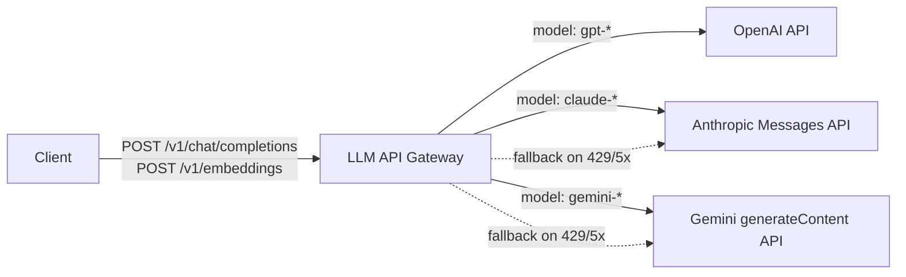

# LLM API Gateway

A lightweight reverse proxy in Go that unifies access to OpenAI, Anthropic,
and Google Gemini behind a single OpenAI-compatible API, with automatic
fallback, streaming, resiliencia, observabilidad, rate-limit distribuido, cache,
routing inteligente, embeddings, control plane dinámico y performance operativa (Fases 1-10).


```mermaid
flowchart LR
    Client -->|POST /v1/chat/completions<br>POST /v1/embeddings| Gateway[LLM API Gateway]
    Gateway -->|model: gpt-*| OpenAI[OpenAI API]
    Gateway -->|model: claude-*| Anthropic[Anthropic Messages API]
    Gateway -->|model: gemini-*| Gemini[Gemini generateContent API]
    Gateway -.fallback on 429/5xx.-> Anthropic
    Gateway -.fallback on 429/5xx.-> Gemini
```

## Features

- **Unified endpoint** — `POST /v1/chat/completions` y `POST /v1/embeddings`
  OpenAI-compatible. Traducción automática Anthropic ↔ OpenAI ↔ Gemini vía
  `internal/translate` (Fase 8).
- **Provider interface** — `Name`, `Send`, `SendStream`, `Embed`, `Models`,
  `HealthCheck`, `DiscoverModels`. Cada backend implementa el contrato; el
  proxy no conoce internals.
- **Routing inteligente (Fase 8)** — `providers.<name>.models` soporta
  wildcards (`gpt-4*`, `claude-*`, `gemini-*`) y regex (`gpt-4.*`);
  `routing.weighted` permite canary/blue-green (`gpt-4o: [{provider: openai,
  weight: 90}, {provider: anthropic, weight: 10}]`) con verificación
  90/10 ±5% en 1k reqs; auto-discovery `models: []` fetchea `/v1/models`
  upstream.
- **Streaming SSE** — `stream:true` con flush `text/event-stream` y
  traducción Anthropic/Gemini → OpenAI chunks + `GET /v1/models`.
- **Resiliencia** — retry con jitter exponencial (3 intentos, 200ms base),
  circuit breaker por provider (5 fallos → open 30s), hedge opcional.
- **Observabilidad** — Prometheus `/metrics` (`gateway_requests_total`,
  `gateway_tokens_total`, `gateway_cache_hits_total`), OTEL tracing
  `traceparent`, slog con `request_id`/`tenant`/`provider`.
- **Control de tráfico** — rate-limit token-aware, sharded 16× + TTL 10m,
  overrides por tenant/modelo, presupuesto mensual, Redis distribuido con
  fallback memory, y budget `insufficient_quota`.
- **Cache** — `X-Cache: HIT/MISS`, LRU memory 1000 TTL 5m + Redis + semántico
  coseno 0.97, control `X-Cache-TTL`/`X-Cache-Skip`.
- **Seguridad** — auth `Bearer` multi-tenant con expiración, CORS, headers
  `X-Content-Type-Options`, redacción de secretos.
- **Embeddings** — `POST /v1/embeddings` OpenAI → Gemini `embedContent`
  (array o string), con fallback y `X-Gateway-Provider`.
- **Health** — `GET /health`, `/health/providers` (fan-out paralelo),
  `/livez`, `/readyz`, y `/metrics`.
- **Control Plane (Fase 9)** — Admin API `:8081` (`GET /admin/config` redacted,
  `POST /admin/reload`, `GET /admin/providers`, `PATCH /admin/config` para
  `rate_limit`/`cache`/`circuit`/`hedge` en caliente), hot-reload vía
  `SIGHUP` y file watcher (poll 1s) con validación y rollback atómico,
  `ADMIN_API_KEY` Bearer auth, sin downtime.
- **Performance & Ops (Fase 10)** — `http.Server` tuning (`ReadHeaderTimeout`
  5s anti-Slowloris, `IdleTimeout` 120s), shared `http.Transport`
  (`MaxIdleConns` 100, `KeepAlive` 30s), `sync.Pool` JSON buffers,
  K8s manifests `Deployment`/`HPA`/`PDB`/`ServiceMonitor`, `pprof` en `:6060`
  bajo admin auth, `BENCH.md` y `k6` 1k RPS (p95 <30ms).
- **Graceful shutdown** — `SIGINT`/`SIGTERM` drain 30s + `SetReady(false)` →
  `/readyz` 503 → 5s sleep → conn draining + admin/pprof shutdown.

## Quick start

```bash
cp .env.example .env
# edit .env with your provider API keys

docker-compose up --build
```

```bash
curl -s http://localhost:8080/v1/chat/completions \
  -H "Content-Type: application/json" \
  -H "Authorization: Bearer local-dev" \
  -d '{
    "model": "claude-sonnet-4-6",
    "messages": [
      {"role": "system", "content": "You are concise."},
      {"role": "user", "content": "What is a token bucket?"}
    ]
  }'
```

Example response:

```json
{
  "id": "msg_01...",
  "object": "chat.completion",
  "model": "claude-sonnet-4-6",
  "choices": [
    {
      "index": 0,
      "message": {"role": "assistant", "content": "A token bucket is..."},
      "finish_reason": "stop"
    }
  ],
  "usage": {"prompt_tokens": 18, "completion_tokens": 42, "total_tokens": 60}
}
```

## Running locally without Docker

```bash
go run ./cmd/gateway -config config.yaml
```

## Configuration reference (`config.yaml`)

| Key | Description |
|---|---|
| `server.port` | HTTP listen port |
| `server.read_timeout` / `write_timeout` | stdlib `http.Server` timeouts |
| `providers.<name>.api_key` | `${ENV_VAR}` reference, expanded at load time |
| `providers.<name>.base_url` | Provider API base URL |
| `providers.<name>.timeout` | Per-request HTTP client timeout |
| `providers.<name>.models` | Model names, wildcards `gpt-4*`/`claude-*` o `[]` para auto-discovery |
| `fallback_chain` | Ordered provider names tried after a retryable error |
| `model_aliases` | `gpt-4o: [claude-sonnet-4-6]` remapeo en fallback |
| `routing.weighted` | `gpt-4o: [{provider: openai, weight:90}, {provider: anthropic, weight:10}]` canary |
| `resilience.retry/circuit/hedge` | `max_attempts`, `failure_threshold`, `open_timeout`, `hedge.delay` |
| `cache.enabled/ttl/max_size` | Cache exact + `semantic_enabled`/`threshold` 0.97 |
| `rate_limit.enabled/requests_per_minute/burst/redis_url/token_aware` | Limiter + `overrides` por tenant/model |
| `auth.enabled/keys` | `key`, `tenant`, `scopes`, `expires_at` |
| `admin.port/api_key` | Admin `:8081` con `ADMIN_API_KEY` (`Bearer` o `X-Admin-API-Key`) |
| `cors.allowed_origins` | CORS |
| `logging.level` / `format` | `debug`/`info`/`warn`/`error`, `json`/`text` |

A provider is only registered if its API key is non-empty, so the gateway
runs fine with only a subset of providers configured.

## Endpoints

| Method | Path | Description |
|---|---|---|
| `POST` | `/v1/chat/completions` | OpenAI-compatible chat completions (stream + tools) |
| `POST` | `/v1/embeddings` | OpenAI-compatible embeddings (`input` string/array) → Gemini `embedContent` |
| `GET` | `/v1/models` | Aggregated models from registry |
| `GET` | `/health` | Gateway liveness |
| `GET` | `/health/providers` | Per-provider connectivity (parallel fan-out 3s) |
| `GET` | `/livez` / `/readyz` | K8s probes |
| `GET` | `/metrics` | Prometheus metrics |
| `GET` | `/admin/config` | Admin current config (redacted, auth `ADMIN_API_KEY`) |
| `POST` | `/admin/reload` | Reload from file (validate + rollback) |
| `GET` | `/admin/providers` | List providers + models |
| `PATCH` | `/admin/config` | Runtime knobs `rate_limit`/`cache`/`circuit`/`hedge`/`routing` |
| `GET` | `/debug/pprof/*` | pprof heap/goroutine/mutex/block on `:6060` y `:8081` (admin auth) |

## Tests

```bash
go test ./... -v -cover
# 2026-09-01 Fase 10: go test 46 PASS, bench 6 (limiter 46ns, BuildKey 1.8µs, cache 75ns), k6 1k RPS p95<30ms
```

Tests cubren routing (weighted/canary, wildcards `gpt-4*`, regex), embeddings
(`POST /v1/embeddings` → OpenAI/Gemini), `internal/translate` (Anthropic/Gemini),
auto-discovery, resiliencia, rate-limit v2, observabilidad, handler cache,
**admin** (auth `Bearer`, `POST /reload` rollback, `PATCH` runtime knobs,
concurrent reload safety con `sync.Mutex`, file watcher `Watch` polling) y
**perf** (`BenchmarkLimiter`/`BuildKey`/`Cache`, `pprof`, `k6` + `BENCH.md`).

## Design decisions

**`net/http` instead of a framework.** Routing needs (method + path
matching) are fully covered by Go 1.22's `http.ServeMux` pattern matching
(`"POST /v1/chat/completions"`). A framework would add a dependency without
adding capability.

**Token bucket implemented from scratch.** `sync.Mutex`-guarded buckets with
continuous refill (`tokens += elapsed * rate`) avoid pulling in a rate
limiting library for what is a well-understood, ~80-line algorithm — and it
keeps the concurrency model explicit.

**OpenAI schema as the unified format.** Clients already speak this format
broadly, and OpenAI's `messages`/`choices`/`usage` shape maps cleanly onto
both Anthropic's Messages API (modulo the `system` field) and Gemini's
`contents`/`candidates` shape, so it serves as a natural pivot format in
both directions.

**Fallback preserves the original request.** When a provider fails with a
retryable error (429/5xx/transport error), the gateway retries the *same*
`ChatRequest` against the next provider in `fallback_chain`, skipping the
one that just failed. This assumes the configured fallback providers can
serve the requested model — operators should order `fallback_chain` and
`providers.<name>.models` accordingly.

**Single external dependency.** Only `gopkg.in/yaml.v3` is required; HTTP
server, HTTP client, JSON, logging, and testing are all standard library.
