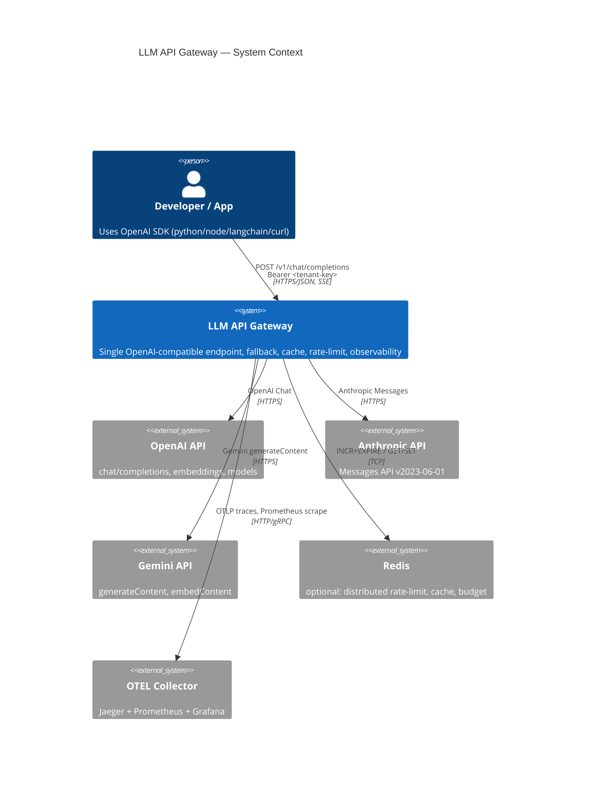
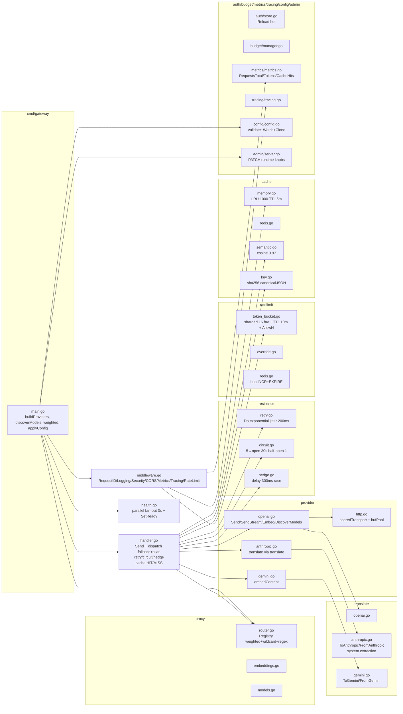
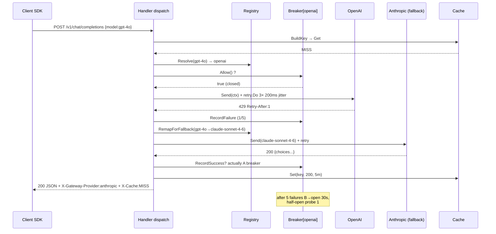

# Architecture — LLM API Gateway

> **Version:** 1.0 · **Date:** 2026-09-01 · **Stack:** Go 1.24 · `net/http` · `prometheus/client_golang` · `go-redis/v9` · `otel`  
> This doc follows C4 model: Context → Container → Component → Code.

---

## 1. C4 Context



**External actors:**
- **Clients** speak *only* OpenAI schema; gateway is drop-in replacement (`base_url=http://gateway:8080/v1`, `api_key=<tenant>`).
- **Upstreams** are isolated behind `Provider` interface; adding Bedrock/Azure is 1 PR (see `internal/provider/`).

---

## 2. C4 Container

```mermaid
flowchart TB
    Client -->|OpenAI SDK| Edge[Edge: TLS + CORS + RequestID + BodyLimit 1MiB]
    Edge --> Auth[Auth & Tenant Middleware<br>API Keys + Scopes + Expiry]
    Auth --> RL[RateLimit v2<br>per-key/per-model/per-token<br>sharded 16x TTL 10m<br>Redis Lua or memory]
    RL --> Budget{Budget?}
    Budget -- exceed --> R429[429 insufficient_quota]
    Budget -- ok --> Cache{Cache? exact/semantic}
    Cache -- hit --> Resp[Response + X-Cache:HIT]
    Cache -- miss --> Router[Semantic Router<br>model→provider alias+weight+regex]
    Router --> CB[Circuit Breaker + Retry + Hedge]
    CB -->|primary| P1[OpenAI]
    CB -->|fallback| P2[Anthropic]
    CB -->|fallback| P3[Gemini]
    P1 & P2 & P3 --> Translate[Translate Layer<br>OpenAI pivot ↔ native]
    Translate --> Stream[SSE Stream Merger<br>data: {...} + [DONE]]
    Stream --> Usage[Usage & Cost Metering<br>tokens + USD]
    Usage --> Resp
    Usage --> OTEL[OTEL: Metrics/Tracing/Logs<br>/metrics, traceparent]
    OTEL --> Prometheus & Jaeger
    Admin[Admin API :8081<br>/admin/* + pprof :6060] -.-> Config[Dynamic Config<br>file+SIGHUP+Watch 1s]
    Config -.-> Router & RL & CB & Cache
```

**Containers (processes):**
| Container | Port | Handler | Notes |
|-----------|------|---------|-------|
| `gateway` | `8080` | `cmd/gateway/main.go` `http.Server{ReadHeaderTimeout 5s, IdleTimeout 120s}` | All `POST /v1/*` + `/health*` + `/metrics` |
| `admin`   | `8081` | `internal/admin/server.go` + pprof | `Bearer ADMIN_API_KEY`, `GET /admin/config` redacted `***`, `POST /admin/reload` 400 rollback |
| `pprof`   | `6060` | same `admin.Handler()` | `GET /debug/pprof/*` behind same auth |
| `redis`   | `6379` | `go-redis/v9` | optional `REDIS_URL`; 50ms timeout → fallback memory |
| `jaeger`  | `4317/16686` | OTEL collector | `OTEL_EXPORTER_OTLP_ENDPOINT` |
| `prometheus`/`grafana` | `9090/3000` | `deploy/prometheus.yml` | `ServiceMonitor` in K8s |

---

## 3. C4 Component — `internal/`



### Key contracts

**`Provider` interface** (`internal/provider/provider.go:33`):
```go
type Provider interface {
  Name() string
  Send(ctx context.Context, req ChatRequest) (ChatResponse, error)
  SendStream(ctx context.Context, req ChatRequest) (<-chan StreamChunk, <-chan error)
  Models() []string
  HealthCheck(ctx context.Context) error
}
type Embedder interface { Embed(ctx, EmbeddingRequest) (EmbeddingResponse, error) }
```
- `Name()` is registry key, also `fallback_chain` entry.
- `Send` is sync; `SendStream` is async channels + `data: [DONE]` (see `proxy/handler.go:390 handleStream`).
- `Models()` may contain wildcards `gpt-4*` or be `[]` for auto-discovery (`DiscoverModels` via `GET /models`).
- Errors are `*ProviderError{Retryable, RetryAfter}` → `IsRetryable` determines fallback; `Retry-After` propagated as header (`handler.go:380 propagateRetryAfter`).

**`Registry`** (`proxy/router.go:20`):
- Resolution order:  weighted exact → exact → weighted pattern → pattern (glob→regex) → `ErrNoProvider` 404.
- `Reload(providers, aliases, weighted)` atomic swap `RWMutex` (Fase 9) — no pointer replacement so handlers see update.
- `RemapForFallback(req, fallback)` uses `model_aliases` → first alias target owned by fallback, else first model of fallback.

**`Translate` pivot** (`internal/translate/`):
- Canonical = OpenAI `ChatRequest`. `ToAnthropic`: `system` extracted → `system` field, `assistant→model`? actually `messages` with `role:assistant→model`. `ToGemini`: `messages→contents` with `role:model` for assistant.
- Keeps `Provider` pure; translation is unit-tested isolated (`tests/translate_test.go`).

---

## 4. Sequence — fallback with retry + circuit



Streaming variant: `handler.go:390 handleStream` branches `req.Stream` → `Content-Type:text/event-stream`, `http.Flusher`, translates `event:content_block_delta` → `ChatCompletionChunk`, no cache, same fallback notification (warn, not yet implemented hedge for streams).

---

## 5. Data flow — rate-limit / budget / cache knobs

- **RateLimit:** `RateLimit(limiter)` middleware uses `Authorization` header as key; `handler.go:234 overrideStore.Resolve(tenant, model)` → per-tenant/model RPM; `tokenAware` → `EstimateTokens(chars/4)` → `AllowN(key+"_tokens", n)`; `Retry-After` seconds.
- **Budget:** `budget.Manager.Check(tenant)` before dispatch; `Record(tenant, tokens, usd=tokens*0.00001)` after success → `429 insufficient_quota` if monthly exceeded.
- **Cache:** `cache.BuildKey(model,messages,temperature,max_tokens,tools)` → `sha256(canonicalJSON)`; respect `X-Cache-Skip:true` and `X-Cache-TTL:100ms`; only `200` non-stream; `memory LRU` → `redis` if `REDIS_URL` → `semantic` wrapper `cosine 0.97`.

---

## 6. Operational concerns

- **Hot reload:** `config.Watch(ctx, path, 1s, onChange)` polls `ModTime` + 100ms debounce; `SIGHUP` handler; `applyConfig(newCfg)` → `Validate` → `buildProviders` → `registry.Reload` → `limiter.UpdateLimits` → `overrideStore.Reload` → `authStore.Reload` → `handlerOpts.SetCache/Circuit/Retry/Hedge/Fallback` → `adminSrv.SetConfig(Clone)`; invalid → 400 rollback keep old (see `tests/admin_test.go` rollback).
- **Graceful drain:** `HealthHandler.SetReady(false)` → `/readyz` 503 draining → 5s sleep for K8s endpoint removal → `admin/pprof Shutdown 5s` → `srv.Shutdown 30s` with `IdleTimeout 120s` (`main.go:326`).
- **Performance:** `sharedTransport MaxIdleConns100/PerHost20/IdleConnTimeout90s/KeepAlive30s/ForceAttemptHTTP2` (`provider/http.go:10`), `bufPool` for `marshalJSON`, `sharded 16× fnv` limiter (56ns/op), `BuildKey 1.8µs`, `Cache hit 75ns` (`BENCH.md`).
- **Observability:** `metrics.RequestsTotal{method,path,status,provider}` `RequestDuration` `TokensTotal` `CacheHits` `ProviderErrors` `CircuitState`; `Tracing` OTEL `traceparent` inject; `Logging` `request_id/tenant/provider/latency_ms`.
- **Security:** `auth` static YAML+env, `hash` not plaintext (TODO), `SecurityHeaders` `nosniff DENY no-referrer`, `CORS` allowlist, `Authorization` redacted in logs (`logger/logger.go`), `Admin` Bearer/X-Admin-API-Key `***` redacted (`admin/server.go:380 redactConfig`).

---

## 7. Deployment — K8s

- `deploy/k8s/deployment.yaml`: 3 replicas RollingUpdate, `terminationGracePeriodSeconds:35`, probes `liveness /livez 10s` `readiness /readyz 5s` `startup /health 5s`, `resources 500m/256Mi→1000m/512Mi`, `securityContext readOnlyRootFilesystem:true runAsNonRoot:65532`.
- `hpa.yaml`: `3→10` cpu70 mem80, `ServiceMonitor` scrapes `8080/metrics` 15s, `PDB minAvailable:2`, `Service` http 80→8080 admin 8081 pprof 6060.

---

## 8. Trade-offs & future

- No `sony/gobreaker` dep — own 188 LOC circuit simplifies hot-reload `UpdateConfig`.
- No framework — `ServeMux` Go 1.22 path patterns enough; avoids Gin/Echo.
- Single dep `yaml.v3` + 5 justified: `prometheus`, `redis`, `otel`, `sync`. See ADR-002/003.
- Backlog (post 1.0): Azure/Bedrock, Ollama, PII guardrails, Stripe billing, WASM plugins — see `PLAN.md:10`.

Refs: `PLAN.md` roadmap 11 fases, `BENCH.md`, `config.yaml`, `deploy/k8s/`, `examples/`.
